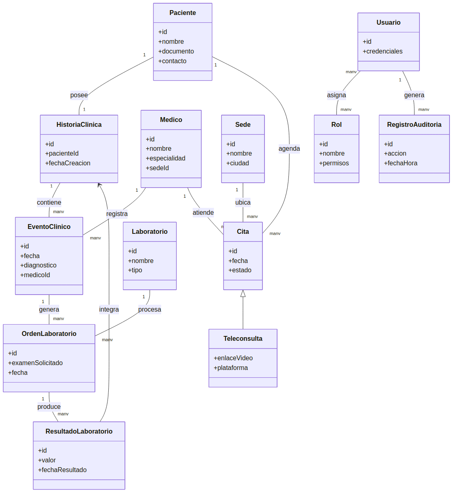

# Modelo conceptual del dominio

Este documento corresponde a la Fase 2 del proyecto y presenta el modelo conceptual del dominio a partir de los requisitos identificados.

Incluye:
- El modelo conceptual del dominio.
- La identificación de las entidades principales.
- Las relaciones entre las entidades del dominio.

## Entidades principales
- **Paciente**, **HistoriaClinica**, **EventoClinico**, **Medico**, **Sede**, **Cita**, **Teleconsulta**, **OrdenLaboratorio**, **ResultadoLaboratorio**, **Laboratorio**, **Usuario**, **Rol**, **RegistroAuditoria**.

## Relaciones entre entidades
- Un Paciente tiene una HistoriaClinica (1:1).
- Una HistoriaClinica contiene muchos EventoClinico (1:N).
- Un EventoClinico es registrado por un Medico (N:1).
- Un Paciente agenda muchas Citas; cada Cita es atendida por un Medico en una Sede, o es una Teleconsulta.
- Una Cita/EventoClinico puede generar una o varias OrdenLaboratorio.
- Una OrdenLaboratorio es procesada por un Laboratorio y produce ResultadoLaboratorio, que se integra a la HistoriaClinica.
- Un Usuario tiene asignado uno o más Rol.
- Cada acceso o modificación relevante genera un RegistroAuditoria.
