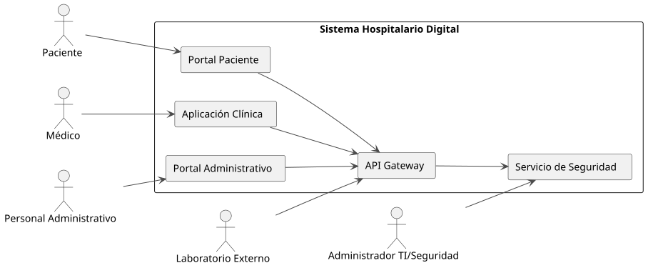
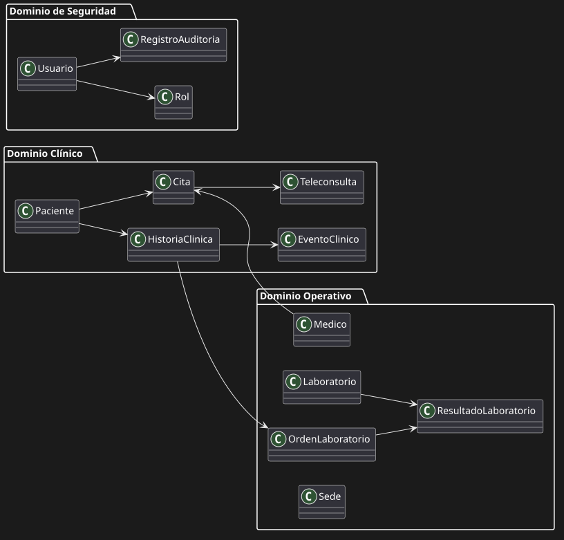
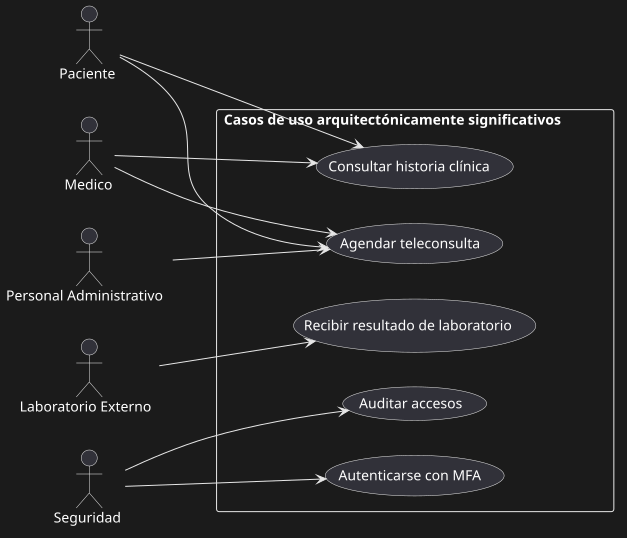
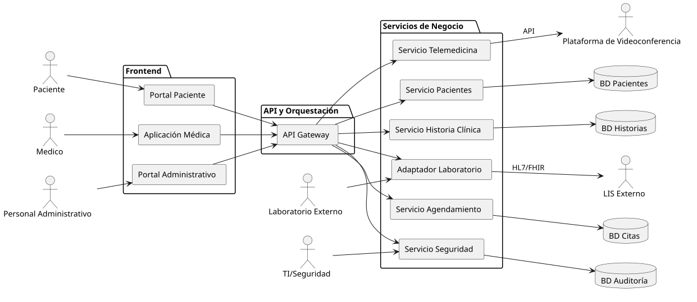
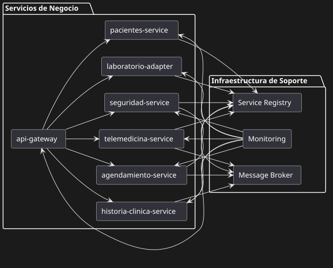
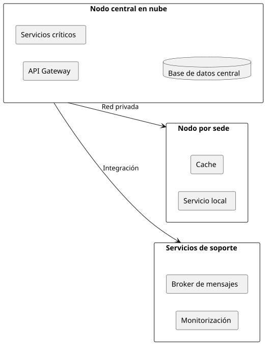

# Vistas arquitectónicas

Este documento corresponde a la Fase 3 del proyecto y representa las vistas arquitectónicas del sistema para describir su estructura, comportamiento y despliegue.

Incluye las siguientes vistas:
- Vista de contexto.
- Vista conceptual.
- Vista de casos de uso.
- Vista lógica.
- Vista de implementación.
- Vista física (despliegue).

## Vista de contexto
Esta vista define los límites del sistema, los actores externos y los sistemas con los que interactúa.

- Límites del sistema.
- Actores externos: paciente, médico, personal administrativo, laboratorio externo y administrador de TI/seguridad.
- Sistemas con los que interactúa: LIS externos, plataforma de videoconferencia, sistema de notificaciones y servicios de identidad.

## Vista conceptual
Esta vista describe los principales dominios funcionales del sistema y la relación entre ellos.

- Dominios funcionales: gestión de pacientes, historia clínica, agendamiento, laboratorio, seguridad e identidad.
- Relación entre dominios: el paciente y la historia clínica se relacionan con citas y resultados de laboratorio; la seguridad administra el acceso a todos los módulos.

## Vista de casos de uso
Esta vista identifica los casos de uso arquitectónicamente significativos y los actores involucrados.

- Casos de uso relevantes: consultar historia clínica desde otra sede, agendar teleconsulta, recibir resultado de laboratorio externo, autenticarse con doble factor y auditar accesos.
- Actores involucrados: paciente, médico, personal administrativo, laboratorio externo y administrador de seguridad.

## Vista lógica

Esta vista organiza los módulos y componentes del sistema y muestra las relaciones entre ellos.

- Organización de módulos y componentes: pacientes, historia clínica, agendamiento, telemedicina, adaptador de laboratorio, seguridad e identidad y API Gateway.
- Relaciones entre componentes: integración por APIs, eventos de negocio y comunicación segura entre servicios.

## Vista de implementación
Esta vista representa la organización de los componentes de software y su estructura de implementación.

- Diagrama de componentes UML.
- Organización de componentes de software por bounded context: `pacientes-service`, `historia-clinica-service`, `agendamiento-service`, `telemedicina-service`, `laboratorio-adapter`, `seguridad-service` y `api-gateway`.

## Vista física (despliegue)
Esta vista describe la infraestructura tecnológica, los nodos y la estrategia de despliegue seleccionada.

- Nodos: nodo central en la nube para servicios críticos, nodos por sede para funciones locales y servicios de soporte.
- Componentes desplegados en cada nodo: servicios de negocio, bases de datos, colas de mensajería, API Gateway y componentes de seguridad.
- Infraestructura tecnológica: contenedores, orquestación con Docker/Kubernetes, redes privadas y monitoreo.
- Estrategia de despliegue: despliegue independiente y versionado por servicio mediante CI/CD.

